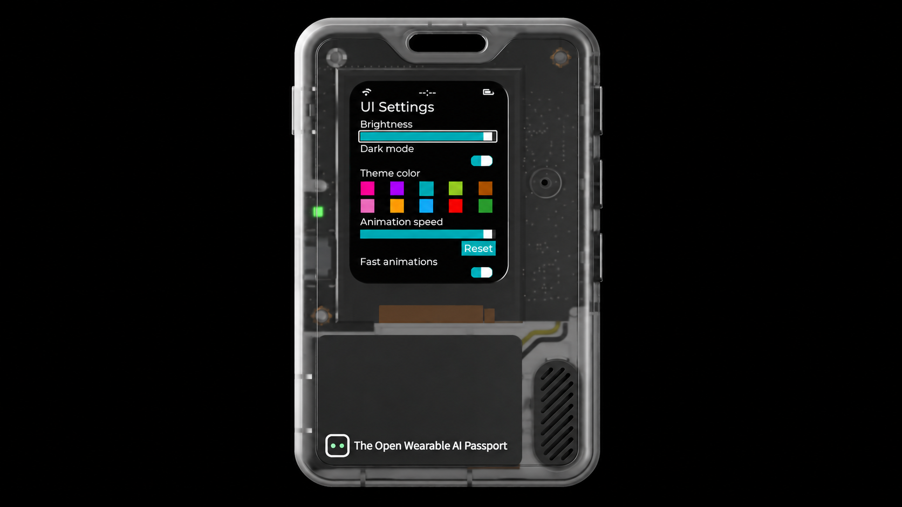
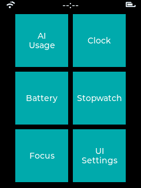
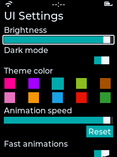

<p align="right"><a href="README.zh_CN.md">简体中文</a> · <strong>English</strong></p>

# AI Passport · WP7 Tile UI

A standalone ESP-IDF application for the **FoloToy AI Passport**. It ports [ZyoungInc's WP7-style LVGL UI](https://github.com/ZyoungInc/JC4880P443C_BSP/tree/wp7) to the Passport's ESP32-C3, 240 × 320 ST7789P3 color display, and three physical buttons. The upstream page objects, settings, and transitions are adapted directly. The original Passport terminal application lives in a separate project.



*The hero is a composite of a device appearance image and an on-device UI Settings capture.*

## Features and current state

- Two-column color tiles, application list, original settings entrance and exit transitions. Brightness, dark mode, theme color, animation speed, and fast animations are saved in NVS.
- **Clock:** set the time with buttons. Time must be set again after power loss; the status bar displays `--:--` until then.
- **Battery:** reads state of charge and cell voltage from the onboard CW2017 gauge; reports unavailable when it cannot read the sensor.
- **Stopwatch:** start, pause, lap, and reset. Timing continues while the page is closed.
- **Focus:** 5/15/25/45-minute presets. Timing continues while the page is closed.
- **AI Usage:** a reserved entry with no account or quota integration yet; it does not invent usage data.
- The status bar's Wi-Fi and battery symbols are part of the UI style and do not indicate live connection or charge state. See the Battery page for the actual reading.

The target board is the **FoloToy AI Passport with an ESP32-C3, 8 MB flash, no PSRAM, a 240 × 320 ST7789P3 SPI display, and three ADC buttons**. Other ESP32 boards need changes to the pins, display, and input drivers in `components/passport_bsp`.

## On-device screenshots

| Home tiles | UI Settings |
| :---: | :---: |
|  |  |

These two 240 × 320 PNGs were reconstructed from actual display updates over the Passport's USB serial port and preserve the original screen layout and pixels.

## Buttons

| Page | Up / Down click | Up / Down hold | OK click | OK hold |
| --- | --- | --- | --- | --- |
| Tiles | Select a tile | Hold Down for the app list | Open the selected tile, or the list if none is selected | Open the list |
| App list | Select an item | — | Open the item | Return to tiles |
| UI Settings | Select a control | — | Change the control | Return with the upstream exit transition |
| Clock | Add 1 hour / 1 minute | Add 6 hours / 10 minutes | — | Return |
| Stopwatch | Lap / reset while paused | — | Start / pause | Return |
| Focus | Change preset / reset while paused | — | Start / pause | Return |

A thin outline marks the selected control because the Passport has no touchscreen.

## Build and flash

1. Install and activate **ESP-IDF 5.5.3** using [Espressif's ESP32-C3 setup guide](https://docs.espressif.com/projects/esp-idf/en/release-v5.5/esp32c3/get-started/index.html). Check the active version with `idf.py --version`.
2. Build from the repository root:

   ```sh
   idf.py set-target esp32c3
   idf.py build
   ```

   On the first build, the component manager downloads LVGL, `esp_lvgl_port`, and `button`; resolved versions are in `dependencies.lock`. The resulting app image is `build/passport_wp7.bin`.
3. Connect the Passport with a data cable, verify its USB serial port and check that its partition layout matches `partitions.csv`. Replace `PORT` with the actual port, such as `/dev/cu.usbmodemXXXX` on macOS, `/dev/ttyACM0` on Linux, or a `COM` port on Windows:

   ```sh
   idf.py -p PORT app-flash
   idf.py -p PORT monitor
   ```

   `app-flash` updates only the application partition; it does not write the bootloader, partition table, or NVS. Exit the monitor with `Ctrl+]`. Close any other application holding the port before flashing.

This repository's partition table targets the Passport layout already verified for this port. Check the layout first on another hardware batch or a device with changed partitions. A full `idf.py flash` also writes the bootloader and partition table; use it only on a dedicated development board or after confirming that layout is appropriate. Generated `build/`, `managed_components/`, and local `sdkconfig` files are not committed; `sdkconfig.defaults` supplies the project settings.

## Capture the physical display

The firmware serves a read-only screenshot command over USB serial. Leave the device on the desired page and run:

```sh
python tools/capture_wp7.py --port PORT \
  --output screenshots/capture.png --wait-for-enter
```

When the script prints `Serial ready`, check the display and press Enter. It reconstructs a PNG from the actual RGB565 flush regions, so the ESP32-C3 needs no additional full-screen buffer. Python needs `pyserial`, which is included in the ESP-IDF environment; standalone use can install `tools/requirements.txt`.

## Sources and acknowledgments

| Project | Used for | Source / license information |
| --- | --- | --- |
| [ZyoungInc/JC4880P443C_BSP `wp7`](https://github.com/ZyoungInc/JC4880P443C_BSP/tree/wp7) | WP7 pages, theme, animations, and settings structure in `main/wp7_ui.c` | Based on commit `9d1743a`; original file marks `SPDX-License-Identifier: Apache-2.0`; see the [porting notes](UPSTREAM.md) |
| [FoloToy/ai-passport](https://github.com/FoloToy/ai-passport) | Passport display, button, I²C, and battery code in `components/passport_bsp` | Upstream repository uses the MIT License; this is a reduced and adapted copy |
| [LVGL](https://github.com/lvgl/lvgl), [ESP-IDF](https://github.com/espressif/esp-idf), [esp_lvgl_port](https://components.espressif.com/components/espressif/esp_lvgl_port) | Graphics, system, and display-port dependencies | Fetched by the ESP-IDF component manager; downloaded component sources are not committed |

**No repository-wide license has been selected yet.** The license notes above apply to their respective source material and do not assign Apache-2.0 or MIT to the whole repository. A license for the new code and an upstream-license review are still needed before public release. See [UPSTREAM.md](UPSTREAM.md) for the exact porting changes.
